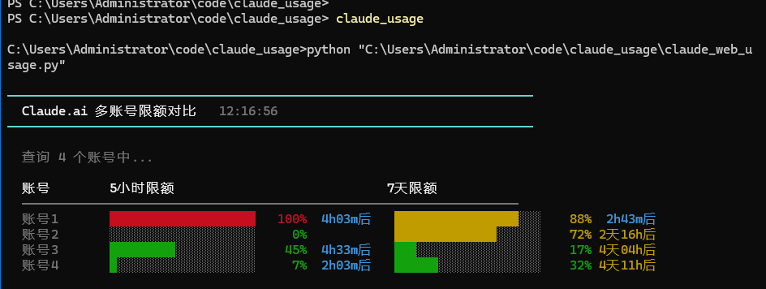
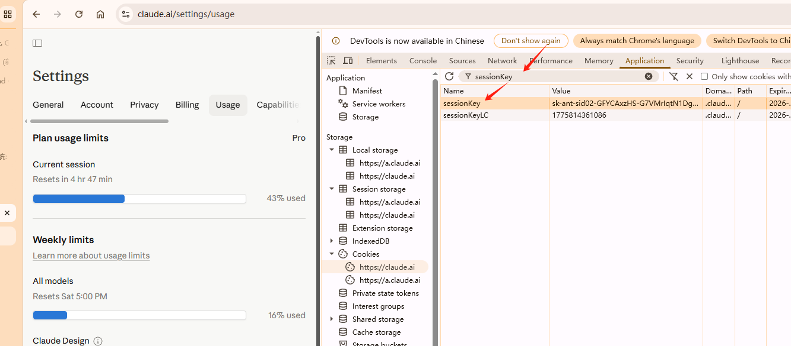
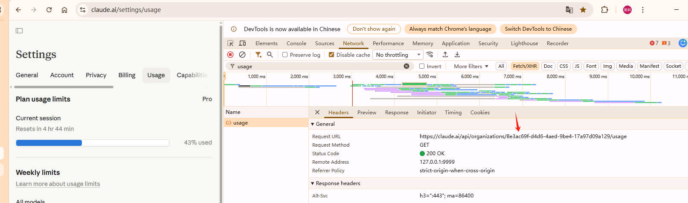

# Claude.ai 多账号限额查询


1. `config.example.json` 改名`config.json`
2. 修改`config.json`
3. 填写`session_key` 和 `org_id`
   - 获取方式:见下面的截屏
   - `proxy` 字段默认是我本机抓包代理(`http://127.0.0.1:9999`),**请改成你自己的代理;若不需要代理,留空字符串 `""` 即可**
4. `python claude_web_usage.py`

建议做成一个全局命令,方便调用。

我的:claude_run.bat:
```bat
python "C:\Users\Administrator\code\claude_usage\claude_web_usage.py"
```


## session_key


打开:https://claude.ai/settings/usage


sessionKey 有效期约一年,且活跃使用会自动续期,基本不用担心过期。



## org_id


